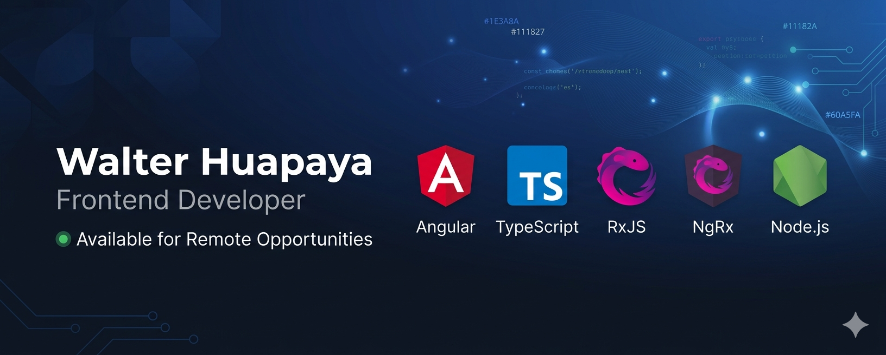

# Hi, I'm Jean Pierre 👋

Frontend Engineer
Angular • TypeScript • RxJS • Node.js

## About Me

- 3+ años desarrollando aplicaciones web empresariales
- Especializado en Angular, TypeScript, RxJS y Node.js
- Experiencia en fintech, ERP y sistemas de gestión
- Disponible para oportunidades remotas

## Tech Stack

## Featured Projects

### Mini Personal CRM
Sistema CRM desarrollado con Angular y Node.js.

🔗 [Demo](https://mini-crm.jpierredev.cloud/)

💻 [Código Fuente](https://github.com/JeanPi69/mini-personal-crm)

### ERP Alta Montaña
ERP empresarial para gestión de operaciones.

### Gestores
Plataforma web de gestión documental y procesos.

## Contact

- [LinkedIn](https://www.linkedin.com/in/walter-jean-pierre-huapaya-ch%C3%A1vez/)
- [Portfolio](https://jpierredev.cloud/)
- [Email](mailto:jeanpierrehuapaya@gmail.com)
<!--
**JeanPi69/JeanPi69** is a ✨ _special_ ✨ repository because its `README.md` (this file) appears on your GitHub profile.

Here are some ideas to get you started:

- 🔭 I’m currently working on ...
- 🌱 I’m currently learning ...
- 👯 I’m looking to collaborate on ...
- 🤔 I’m looking for help with ...
- 💬 Ask me about ...
- 📫 How to reach me: ...
- 😄 Pronouns: ...
- ⚡ Fun fact: ...
-->
